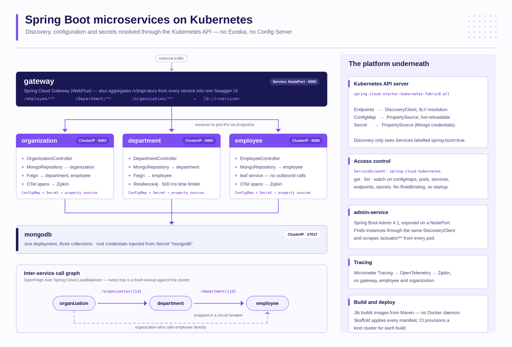

# Spring Boot Microservices on Kubernetes

A four-service Spring Boot system that gets its **service discovery, its configuration and its
secrets from the Kubernetes API itself**. There is no Eureka, no Consul, no Config Server and no
sidecar. A `@FeignClient(name = "employee")` resolves because something read the `employee`
Endpoints object out of the cluster a moment earlier.

This document describes the code as it stands: what each module does, how a request travels
through it, what the cluster has to provide for any of it to start, and where the sharp edges are.



---

## Table of contents

- [The idea](#the-idea)
- [Stack](#stack)
- [Modules](#modules)
- [How a call gets resolved](#how-a-call-gets-resolved)
- [How configuration gets loaded](#how-configuration-gets-loaded)
- [What the cluster must provide](#what-the-cluster-must-provide)
- [Resilience](#resilience)
- [API surface](#api-surface)
- [Running it](#running-it)
- [Testing](#testing)
- [Observability](#observability)
- [Repository layout](#repository-layout)
- [Sharp edges](#sharp-edges)
- [Branches](#branches)
- [Origins](#origins)

---

## The idea

Most Spring Cloud tutorials bolt a service registry onto Kubernetes and end up running two
discovery systems at once. This project does the opposite: it deletes the registry and lets
Kubernetes be the registry.

Three things follow from that, and they are the whole point of the code:

| Concern | Classic Spring Cloud | Here |
| --- | --- | --- |
| Discovery | Eureka server + client heartbeats | `Endpoints` objects, read through the Kubernetes API |
| Configuration | Config Server + Git backend | `ConfigMap`, mapped to a `PropertySource` |
| Secrets | Vault or encrypted properties | `Secret`, mapped to a `PropertySource` |

The cost is that the application now needs an identity in the cluster and permission to read
those objects. That is what `k8s/privileges.yaml` is for, and forgetting it is the single most
common reason a pod here fails to start.

Everything is wired by one starter:

```xml
<dependency>
    <groupId>org.springframework.cloud</groupId>
    <artifactId>spring-cloud-starter-kubernetes-fabric8-all</artifactId>
</dependency>
```

`-all` pulls in discovery, config and the Fabric8 Kubernetes client together. Every module
depends on it, including the gateway and the admin console.

---

## Stack

| | |
| --- | --- |
| Java | 25 |
| Spring Boot | 4.1.1 |
| Spring Cloud | 2025.1.3 |
| Discovery / config | Spring Cloud Kubernetes (Fabric8 client) |
| Gateway | Spring Cloud Gateway, WebFlux server |
| Inter-service calls | OpenFeign over Spring Cloud LoadBalancer |
| Resilience | Resilience4j via Spring Cloud CircuitBreaker |
| Persistence | Spring Data MongoDB |
| API docs | springdoc-openapi 3.1.0, aggregated at the gateway |
| Tracing | Micrometer Tracing → OpenTelemetry → Zipkin |
| Monitoring | Spring Boot Admin 4.1.2 |
| Images | Jib 3.5.2 (no Docker daemon required) |
| Deployment | Skaffold v4beta5 + raw manifests |
| CI | CircleCI — SonarCloud analysis, plus a full deploy into a throwaway `kind` cluster |
| Tests | JUnit 5, Testcontainers 2.0.5, Fabric8 mock server, Hoverfly |

---

## Modules

| Module | Port | Service type | Talks to | Notable |
| --- | --- | --- | --- | --- |
| `gateway-service` | 8080 | NodePort | all three | Reactive gateway; merges every service's OpenAPI doc into one Swagger UI |
| `organization-service` | 8080 | ClusterIP | department, employee | Top of the aggregation chain |
| `department-service` | 8080 | ClusterIP | employee | The only module with a circuit breaker |
| `employee-service` | 8080 | ClusterIP | — | Leaf service; owns the deliberate-latency endpoint |
| `admin-service` | 8080 | NodePort | all three | Spring Boot Admin server, discovers targets by label |

MongoDB runs as a single `Deployment` plus a `ClusterIP` Service, shared by the three data-owning
services, each writing its own collection.

### The label contract

`employee`, `department` and `organization` Services carry this label:

```yaml
metadata:
  labels:
    spring-boot: "true"
```

That is not decoration. `admin-service` filters discovery by it:

```yaml
spring.cloud.kubernetes.discovery.service-labels.spring-boot: true
```

Drop the label and the service disappears from the admin console while continuing to serve
traffic normally.

---

## How a call gets resolved

`organization` asking `department` for data is four hops, none of which involve a registry:

```
@FeignClient(name = "department")
        │
        ▼
Spring Cloud LoadBalancer                 needs instances for "department"
        │
        ▼
Fabric8 KubernetesDiscoveryClient         GET /api/v1/namespaces/<ns>/endpoints/department
        │
        ▼
pod IPs from the Endpoints object         one is chosen, round-robin
```

The gateway does the same thing reactively. Its routes never name a host:

```yaml
- id: employee
  uri: lb://employee
  predicates:
    - Path=/employee/**
  filters:
    - RewritePath=/employee/(?<path>.*), /$\{path}
```

`lb://employee` means "ask the load balancer", and the load balancer asks the API server. The
`RewritePath` filter strips the prefix, so `/employee/department/5` arrives at the pod as
`/department/5`.

### Call graph

```
gateway ──┬─→ organization ──┬─→ department ──→ employee
          │                  └─→ employee
          ├─→ department ────────────────────→ employee
          └─→ employee
```

`organization` reaches employees two ways on purpose: through `department`
(`/{id}/with-departments-and-employees`, a two-hop fan-out) and directly
(`/{id}/with-employees`, one hop).

---

## How configuration gets loaded

Each service reads two cluster objects **named after `spring.application.name`**. That name match
is the entire binding mechanism — a `ConfigMap` called `employees` would be silently ignored by
the `employee` service.

```
ConfigMap "employee"   label spring.cloud.kubernetes.config: "true"   →  application.properties
Secret    "employee"   label spring.cloud.kubernetes.secret: "true"   →  username / password
        │
        ▼  read during bootstrap
Spring Environment
```

Both are pulled in before the context refreshes, which is why every Deployment sets:

```yaml
env:
  - name: SPRING_CLOUD_BOOTSTRAP_ENABLED
    value: "true"
  - name: SPRING_CLOUD_KUBERNETES_SECRETS_ENABLEAPI
    value: "true"
  - name: SPRING_CLOUD_KUBERNETES_SECRETS_ENABLED
    value: "true"
```

The ConfigMaps carry Mongo connection details, the Secrets carry the credentials:

```yaml
# <service>/k8s/configmap.yaml
data:
  application.properties: |-
    spring.mongodb.host: mongodb
    spring.mongodb.database: admin
    spring.mongodb.authentication-database: admin
```

```yaml
# <service>/k8s/secret.yaml
data:
  spring.mongodb.password: <base64>
  spring.mongodb.username: <base64>
```

`spring.mongodb.host` resolves to the MongoDB **Service** name — in-cluster DNS, no discovery
client involved. Only Spring-to-Spring traffic goes through `lb://`.

`gateway-service` and `admin-service` have a ConfigMap but no Secret and no RoleBinding: neither
touches the database, so neither needs credentials. Their ConfigMaps carry routing rules and
discovery filters instead.

---

## What the cluster must provide

Reading ConfigMaps, Secrets and Endpoints from inside a pod is a privileged operation. Apply
`k8s/privileges.yaml` first, or every pod will fail at startup with a 403 from the API server.

```yaml
ServiceAccount: spring-cloud-kubernetes
Role:           get · list · watch
                on configmaps, pods, services, endpoints, secrets
RoleBinding:    binds the two together
```

Every Deployment then claims that identity:

```yaml
spec:
  serviceAccountName: spring-cloud-kubernetes
```

The Role is namespace-scoped. Running these services across namespaces means a `ClusterRole`
plus `spring.cloud.kubernetes.discovery.all-namespaces: true`, which is commented out in
`department-service/src/main/resources/application.yml` and in the admin bootstrap.

---

## Resilience

`department-service` is the only module that wraps an outbound call. Its configuration lives in
`DepartmentApplication`:

| Setting | Value |
| --- | --- |
| Time limiter | 500 ms |
| Sliding window | 10 calls |
| Failure rate threshold | 66.6 % |
| Slow call rate threshold | 66.6 % |

`employee-service` provides the matching fixture — an endpoint that sleeps for two seconds:

```java
@GetMapping("/department-with-delay/{departmentId}")
public List<Employee> findByDepartmentWithDelay(@PathVariable String departmentId)
        throws InterruptedException {
    Thread.sleep(2000);
    return repository.findByDepartmentId(departmentId);
}
```

Two seconds against a 500 ms limiter means every call through
`/department/{id}/with-employees-and-delay` times out. Once the ten-call window has filled and
two thirds of it has failed, the breaker named `delayed-circuit` opens and the endpoint starts
failing fast instead of waiting. That is the demo: a guaranteed-slow dependency and a breaker
sized to trip on it.

---

## API surface

All three services are reachable directly (`ClusterIP`) or through the gateway under a prefix.

### employee-service

| Method | Path | |
| --- | --- | --- |
| `POST` | `/` | create |
| `GET` | `/` | all |
| `GET` | `/{id}` | by id |
| `GET` | `/department/{departmentId}` | by department |
| `GET` | `/organization/{organizationId}` | by organization |
| `GET` | `/department-with-delay/{departmentId}` | as above, after a 2 s sleep |

### department-service

| Method | Path | |
| --- | --- | --- |
| `POST` | `/` | create |
| `GET` | `/` | all |
| `GET` | `/{id}` | by id |
| `GET` | `/{id}/with-employees` | joins employees over Feign |
| `GET` | `/{id}/with-employees-and-delay` | same join, through the circuit breaker |
| `GET` | `/organization/{organizationId}` | by organization |
| `GET` | `/organization/{organizationId}/with-employees` | by organization, employees joined |
| `GET` | `/feign` | smoke test — fetches employees of department `1` |

### organization-service

| Method | Path | |
| --- | --- | --- |
| `POST` | `/` | create |
| `GET` | `/` | all |
| `GET` | `/{id}` | by id |
| `GET` | `/{id}/with-departments` | one hop |
| `GET` | `/{id}/with-departments-and-employees` | two hops, fans out through department |
| `GET` | `/{id}/with-employees` | one hop, straight to employee |

Through the gateway the same endpoints sit under `/employee/**`, `/department/**` and
`/organization/**`.

---

## Running it

### Build

```bash
mvn clean install
```

The test suites start real MongoDB containers, so a Docker daemon has to be reachable. Skip them
with `-DskipTests` if you only want artifacts.

### On a cluster

Skaffold does everything — Jib builds each image straight from Maven, then every manifest is
applied:

```bash
kind create cluster --name c1     # or: minikube start --memory=4g
skaffold dev                      # build, deploy, stream logs, redeploy on change
```

`skaffold run` does the same without the watch loop. Each module also carries its own
`skaffold.yaml`, so a single service (plus MongoDB and the RBAC objects it needs) can be brought
up alone:

```bash
cd employee-service && skaffold dev
```

No Docker daemon is needed for the build: Jib assembles image layers from the Maven output and
pushes them directly.

### Reaching it

```bash
kubectl port-forward svc/gateway 8080:8080

curl -X POST localhost:8080/organization/ \
     -H 'Content-Type: application/json' \
     -d '{"name":"Acme","address":"Main St"}'

curl localhost:8080/organization/
```

Swagger UI, with all three services in the dropdown, is at `localhost:8080/swagger-ui.html`.

### Checking the wiring

```bash
kubectl get endpoints employee        # what discovery actually returns
kubectl get svc -l spring-boot=true   # what the admin console will find
kubectl logs deploy/department | grep -i kubernetes
```

`department-service` logs `org.springframework.cloud.kubernetes` at `TRACE`, which is the fastest
way to see discovery and config resolution happening.

---

## Testing

Three tiers, increasing in how much of Kubernetes they pretend to be:

**1 — Plain integration.** `EmployeeAPITest`, `DepartmentAPITest`, `OrganizationAPITest`. A real
MongoDB via Testcontainers, Kubernetes explicitly switched off:

```java
@SpringBootTest(webEnvironment = RANDOM_PORT, properties = {
    "spring.cloud.kubernetes.discovery.enabled=false",
    "spring.cloud.kubernetes.config.enabled=false"
})
@Testcontainers
```

**2 — Mock API server.** `EmployeeKubernetesMockTest` and `DepartmentAPIAdvancedTest` run the
Fabric8 `KubernetesMockServer`, create a real `ConfigMap` in it pointing at the Testcontainers
Mongo port, and let the application bootstrap from it — exercising the config path, not just the
controllers.

`DepartmentAPIAdvancedTest` goes further: it also creates `Service` and `Endpoints` objects for
`employee`, then uses Hoverfly to simulate HTTP responses at the resolved address. Discovery,
load balancing and the Feign call are all real; only the remote service is fake.

**3 — Real Kubernetes.** `EmployeeKubernetesTest` boots a k3s container. It is committed fully
commented out — a starting point rather than a running test.

---

## Observability

| | |
| --- | --- |
| Actuator | All endpoints exposed, `health.show-details: ALWAYS` on the three data services |
| Admin | Spring Boot Admin discovers pods by the `spring-boot=true` label and scrapes their actuators |
| Tracing | Micrometer Tracing → OpenTelemetry → Zipkin, on `gateway`, `employee` and `organization` |
| API docs | `GatewayApi` reads the gateway's own `RouteDefinitionLocator` and registers a Swagger URL per route |

The API-doc aggregation is worth a look — the gateway does not hardcode the list of services:

```java
definitions.stream()
    .filter(rd -> rd.getId().matches("employee|department|organization"))
    .forEach(rd -> urls.add(new SwaggerUrl(rd.getId(),
                                           DEFAULT_API_DOCS_URL + "/" + rd.getId(), null)));
```

Routes are discovered, then each one's `/v3/api-docs` is pulled through the gateway and offered
in the Swagger UI dropdown.

---

## Repository layout

```
.
├── k8s/                          shared cluster objects
│   ├── privileges.yaml           ServiceAccount + Role + RoleBinding  ← apply first
│   ├── mongodb-deployment.yaml   MongoDB Deployment + Service
│   ├── mongodb-configmap.yaml    database name
│   ├── mongodb-secret.yaml       root credentials
│   └── ingress.yaml              legacy, not applied by Skaffold
│
├── <service>/
│   ├── k8s/
│   │   ├── deployment.yaml       image, ServiceAccount, bootstrap env vars
│   │   ├── service.yaml          ClusterIP or NodePort, spring-boot label
│   │   ├── configmap.yaml        Mongo host / database
│   │   ├── secret.yaml           Mongo credentials      ─┐ data services
│   │   └── rolebinding.yaml      secret-read permission ─┘ only
│   ├── skaffold.yaml             deploy this service on its own
│   ├── Dockerfile                unused — Jib builds the images
│   └── src/
│
├── skaffold.yaml                 builds all five, applies every manifest
├── pom.xml                       version management for all modules
└── .circleci/config.yml          Sonar analysis + kind deployment
```

---

## Sharp edges

Things worth knowing before lifting any of this into a real system:

- **Credentials are committed.** `k8s/mongodb-secret.yaml` and each service's `secret.yaml`
  contain base64 values in Git. Base64 is encoding, not encryption. Fine for a throwaway cluster;
  nowhere near acceptable otherwise.
- **The admin console is wide open.** `SecurityConfiguration` calls `permitAll()` and disables
  CSRF, and the Service is a NodePort.
- **`k8s/ingress.yaml` is dead.** It targets `extensions/v1beta1`, removed in Kubernetes 1.22, and
  is commented out of `skaffold.yaml`. Port-forward the gateway instead.
- **The three `rolebinding.yaml` files collide.** Each defines a Role literally named
  `view-secrets`; applying all three leaves one Role, last-write-wins. Only the RoleBinding names
  differ, and all of them point at the same ServiceAccount.
- **`DepartmentWithRestTemplateController` is unreachable.** It has no `@RestController`
  annotation. It exists to show the `@LoadBalanced RestTemplate` alternative to Feign — the same
  `lb://` resolution, different client.
- **`department-service` is not traced.** It is the one module without the OpenTelemetry exporter
  on its classpath, so the middle of the call chain is missing from Zipkin.
- **The `Dockerfile`s are vestigial.** Jib never reads them, and `admin-service` does not have one.
- **MongoDB has no volume.** `mongodb-deployment.yaml` declares no `PersistentVolumeClaim`;
  restarting the pod loses the data.

---

## Branches

| Branch | |
| --- | --- |
| `master` | this architecture — gateway, three services, admin, Kubernetes-native discovery |
| `hybrid` | adds a `spring-cloud-kubernetes-discovery-ext` module: a custom `ServiceRegistry` and auto-registration, so services register themselves rather than being discovered purely from Endpoints |
| `swagger` | an earlier, leaner snapshot — no per-service RoleBindings, fewer tests |

Both are behind `master` and carry their own build configuration.

---

## Origins

Forked from [piomin/sample-spring-microservices-kubernetes](https://github.com/piomin/sample-spring-microservices-kubernetes)
by Piotr Mińkowski, who wrote the original code and the articles that explain the design decisions
behind it. This README is a rewrite that documents the current state of the code rather than the
articles; the upstream repository remains the reference for the tutorial material.
